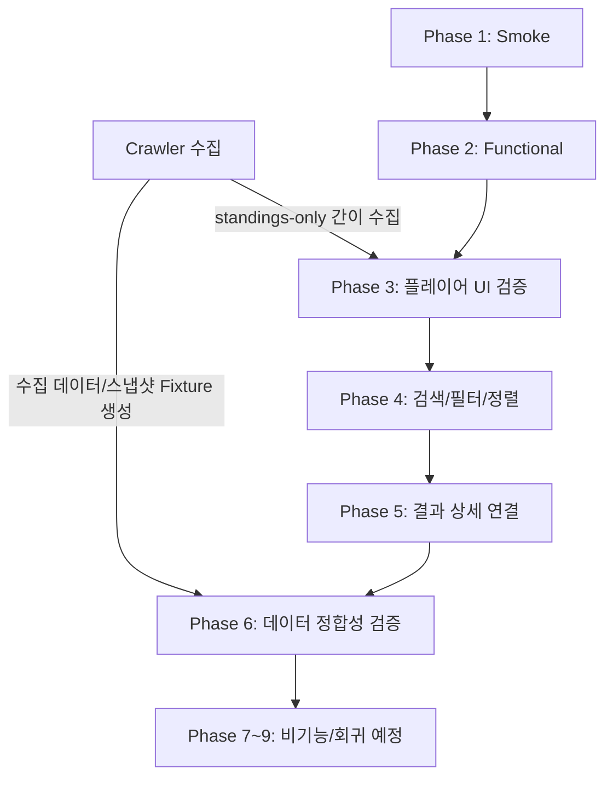

# WSOP Web 통합 테스트 시나리오 및 단계별 검증 가이드

이 문서는 WSOP Web 프로젝트의 전체 검증 체계(Phase 1 ~ Phase 9 및 크롤러)의 설계 방식, 단계별 목적, 상세 테스트 시나리오, 검증 기준, 그리고 실행 및 리포트 확인 방법을 정리한 종합 가이드라인입니다.

---

## 1. 테스트 아키텍처 및 설계 방향

WSOP Web 테스트 체계는 테스트의 성격 및 실행 비용을 고려하여 **"UI 표현/기능 흐름 검증(Phase 1~5)"**과 **"데이터 및 수치 정합성 검증(Phase 6)"**, 그리고 **"원천 데이터 수집(Crawler)"**으로 역할을 명확히 격리 설계했습니다.



### 핵심 설계 원칙
1. **검증 목적의 격리**:
   - **Phase 3 ~ 5**는 실제 페이지에 보여지는 레이아웃, 조작성, UI 노출 유무만을 신뢰도 높게 검증합니다.
   - 우승 횟수(Bracelets/Rings), 상금 합산(Earnings) 등 수치 데이터의 일치 여부는 오직 **Phase 6**에서만 검증하여 테스트 실패 노이즈를 최소화합니다.
2. **크롤러 의존성 최소화**:
   - UI 검증(Phase 3) 시 크롤러를 풀 버전으로 오랜 시간 구동하지 않고, `standings-only` 모드로 타겟 대상자의 식별정보만 빠르게 수집해 UI 매핑을 검증합니다.

---

## 2. 테스트 단계별 요약 표

| 단계 (Phase ID) | 한글 명칭 | 구현 여부 | 중점 검증 영역 | 최종 리포트 파일명 패턴 |
| :--- | :--- | :---: | :--- | :--- |
| **Phase 1** | 공개 페이지 기본 점검 | **완료** | 주요 공개 페이지 접근 상태, 콘솔 에러, 내부 링크 샘플 | `wsop-public-smoke-{timestamp}-report-ko.html` |
| **Phase 2** | 공개 웹 기능 흐름 점검 | **완료** | Schedule, Search, Standings, News 사용자 흐름 탐색 | `wsop-public-functional-{timestamp}-report-ko.html` |
| **Phase 3** | 플레이어 표현 및 식별 UI | **완료** | 플레이어 이름, 국기/국가, 아바타 이미지, 10대 레전드 특수 표현 | `wsop-public-player-presentation-{timestamp}-report-ko.html` |
| **Phase 4** | 검색, 필터, 정렬 심화 | **완료** | 검색창 입력 반응, 탭 전환, 정렬 조작, pagination 안정성 | `wsop-public-search-filter-sort-{timestamp}-report-ko.html` |
| **Phase 5** | 결과 상세 연결 무결성 | **완료** | 프로필 결과 목록 row와 결과 상세 페이지 간 양방향 링크 무결성 | `wsop-public-result-detail-{timestamp}-report-ko.html` |
| **Phase 6** | 데이터/API 정합성 검증 | **완료** | 수집된 Fixture와 공개 UI 수치(상금, 우승 등) 데이터 비교 | `wsop-public-data-integrity-{timestamp}-report-ko.html` |
| **Phase 7** | 성능 및 안정성 점검 | **완료** | 로딩 속도 측정, 메모리 및 커넥션 누수 확인, 지연 요청 감시 | Playwright HTML Report |
| **Phase 8** | 화면 회귀 검증 | **완료** | 해상도별 스크린샷 픽셀 단위 비교, 반응형 깨짐 자동 감지 | Baseline 이미지 대조 / Playwright Report |
| **Phase 9** | 전체 회귀 검증 | **완료** | 릴리즈 전 종합 스위트 자동 실행 및 릴리즈 게이트 판정 | `wsop-regression-summary-{timestamp}.json` |
| **Crawler** | 플레이어 스탠딩 크롤러 | **완료** | 스탠딩 TOP 플레이어 데이터 및 상세 대회 입상 실적 수집 | `wsop-player-crawler-live-{timestamp}-report-ko.html`<br>`wsop-player-crawler-live-{timestamp}-{brand}-report-ko.html` |

---

## 3. 단계별 상세 시나리오 및 검증 항목

### 1단계 (Phase 1): 공개 페이지 기본 점검 (Public page smoke)
* **목적**: 주요 공개 페이지가 에러 없이 정상적으로 렌더링되며, 콘솔 에러가 발생하지 않는지 신속히 확인합니다.
* **실행 시나리오**:
  1. `/`, `/schedule/`, `/player-standings/`, `/player-search/`, `/hall-of-fame/`, `/news/` 페이지에 차례로 접속합니다.
  2. 페이지 로드 시 HTTP Response Status가 `200` 계열인지 검증합니다.
  3. 페이지별 핵심 문구(예: `Schedule`, `Standings` 등)가 보이는지 탐색합니다.
  4. 데스크톱 상단 네비게이션바의 메뉴가 목적지 도달성을 확보하고 있는지 확인합니다.
  5. 페이지 내 무작위로 추출한 30개의 내부 링크가 정상 응답을 주는지 확인합니다 (보안 봇 차단 등으로 인한 `403`/`405`는 정상 참작).
  6. 브라우저 콘솔 에러를 수집하되, 제3자 광고/추적 및 주기적인 SSE 끊김 관련 소음(noisy error)은 필터링합니다.

### 2단계 (Phase 2): 공개 웹 기능 흐름 점검 (Public functional flows)
* **목적**: 사용자가 웹사이트 내부에서 특정 정보를 탐색하고 상세로 진입하는 다이나믹한 흐름을 검증합니다.
* **실행 시나리오**:
  - **Tournament Schedule**: `/schedule/`에 접근한 후 탭/필터를 전환하고, 목록 내 토너먼트를 클릭하여 상세 페이지로 정상 이동하는지 확인합니다.
  - **Player Search**: `/player-search/`에서 대표 플레이어(`Phil Hellmuth` 등)를 검색하고 프로필 상세 페이지로 도달이 가능한지 확인합니다.
  - **Player Standings**: `/player-standings/`에서 All-Time Earnings, Bracelets, Rings 랭킹 카드 영역을 탐색하고 상위 플레이어 프로필로 진입합니다.
  - **News**: `/news/` 목록에서 최신 뉴스의 제목을 기억해 상세 뉴스 본문으로 진입한 뒤, 제목과 날짜가 일치하고 본문 영역이 정상 노출되는지 검증합니다.

### 3단계 (Phase 3): 플레이어 표현 및 식별 UI (Player Presentation & Identity UI)
* **목적**: 크롤러를 통해 수집된 플레이어가 공개 UI 상에서 올바르게 이름, 국기, 이미지, 배지가 노출되는지 검증합니다.
* **실행 시나리오**:
  1. 테스터는 `scripts/run-phase3-player-presentation.cjs`를 구동합니다.
  2. 크롤러의 `standings-only` 모드가 동작하여 Standings의 주요 카테고리별로 상위 n명(기본 50명)의 기본 정보(이름, rank, URL 등)를 빠르게 수집합니다.
  3. Playwright가 구동되어 수집된 리스트의 플레이어 이름, 국기/국가 아이콘, 아바타 이미지가 깨지지 않고 잘 노출되는지 확인합니다.
  4. Player Search 자동완성 영역에 특정 탑랭커 입력 시 올바른 플레이어 정보가 드롭다운에 출력되는지 검증합니다.
  5. `Johnny Moss`, `Daniel Negreanu` 등 **10대 레전드(Legend 10)** 전용 특수 프로필 페이지를 확인하여 'Hall of Famer', 'Poker Hall of Fame Inductee' 배지나 특수 탭 신호가 정상 표출되는지 검증합니다.
* **예외 처리 및 성능 최적화**:
  - **API 불안정성 대응**: `Phil Ivey` 및 `Michael Mizrachi` 등 특정 선수의 경우 외부 WSOP API의 일시적 응답 누락으로 자동완성 및 검색 결과가 누락되는 불안정 현상이 발생할 수 있습니다. 이를 `known-exceptions.fixture.json`에 예외 항목(`warningOnly: true`)으로 등록하여 실패 시 빌드가 실패하지 않고 **Warning**으로 안전하게 기록 및 감시됩니다.
  - **DOM 일괄 추출 최적화 (Batch Extraction)**: 150명 이상의 많은 크롤러 수집 대상을 UI 테스트할 때 발생하는 Playwright IPC 지연 및 E2E 타임아웃 문제를 해결하기 위해, 페이지별 단 1회의 브라우저 DOM 일괄 직렬화(`page.$$eval`)를 거쳐 로컬 캐시 메모리에서 대상을 고속 매칭 및 검증하는 배치 추출 아키텍처가 적용되어 있습니다. (150+명 대상 100% 검증을 약 40초 내 소화)
  - **Stage 서버 이미지 강등**: 개발(Stage) 서버 환경에서는 아바타 이미지 유실을 `ENVIRONMENT=stage` 감지 시 자동으로 **Warning** 처리하여 유연하게 대처합니다.

### 4단계 (Phase 4): 검색, 필터, 정렬 심화 (Search, filter, and sort depth)
* **목적**: 검색/필터/정렬 목록에서 필터를 전환하거나 페이징 처리를 수행할 때 UI 레이아웃이 붕괴되거나 먹통이 되지 않는지 조작 안정성을 확인합니다.
* **실행 시나리오**:
  - **검색 Edge Case**: 대소문자 무관 검색, 부분 검색, 앞뒤 공백 포함, 검색 결과 없음(No matches found), 특수문자/비영문 검색어 입력 시 반응을 체크합니다.
  - **탭 및 필터**: Player Search 및 Standings에서 Trending, Winners, Player of the Year 등의 전환이 자연스럽게 이루어지는지 체크합니다.
  - **정렬/페이징**: `All Player Stats` 리스트에서 각 컬럼 정렬 버튼 클릭 시 목록이 정상 갱신되는지, 페이징 또는 'Load More' 클릭 시 리스트가 망가지지 않는지 확인합니다.
  - **안정성 가드**: 숫자형 페이징 처리 중, 마지막 페이지를 눌렀을 때 간헐적으로 최대 페이지 번호가 무한히 증가하는 버그가 없는지 감시합니다.

### 5단계 (Phase 5): 결과 상세 연결 무결성 (Result Detail Integrity)
* **목적**: 플레이어 프로필의 입상 실적 row와 해당 대회의 최종 결과 상세 페이지(`tournaments/result/*`) 간의 상호 연결성을 확인합니다.
* **실행 시나리오**:
  1. 플레이어 프로필 페이지 진입 후 'Results' 목록의 특정 입상 기록 row를 확인합니다.
  2. 해당 row의 대회명 링크를 클릭하여 Result Detail 상세 페이지로 이동합니다.
  3. 이동한 상세 페이지의 결과 테이블에서, 원래 대상 플레이어의 순위(Rank/Place)와 획득한 상금(Earnings) 등 핵심 필드가 잘 출력되어 있는지 검증합니다.
  4. 그 결과 row에 있는 플레이어 링크(프로필 백링크)를 클릭했을 때, 다시 최초의 플레이어 프로필 페이지로 원활하게 리다이렉트되는지 검증하여 무결한 링킹을 보장합니다.

### 6단계 (Phase 6): 데이터/API 정합성 검증 (Data and API integrity)
* **목적**: 수집된 크롤러 원천 데이터(또는 Fixture 데이터)와 실제 공개 웹의 UI 수치를 1:1 정밀 대조하여 상금 합산이나 우승 기록이 실제 사이트에 정상 반영되어 있는지 검증합니다.
* **실행 시나리오**:
  1. 수집되어 있는 Expected Fixture 데이터 또는 크롤러 스냅샷을 로드합니다.
  2. 스탠딩 목록의 카테고리별 상금/포인트 합산, 획득한 팔찌(Bracelets)/반지(Rings) 개수, 캐시(Cashes) 횟수가 실제 화면 수치와 정확하게 부합하는지 1:1 대조합니다.
  3. 프로필 요약 카드에 기록된 통계 수치가 하단 상세 탭들의 기록을 모두 합산(수계산)했을 때의 결과와 정확하게 논리적으로 일치하는지 확인합니다.
  4. 만약 `DATA_SOURCE=crawler`가 활성화되어 있다면, 크롤러 동작 도중 발생할 수 있는 일시적인 누락 현상 등을 참작하여 경미한 불일치는 Warning으로 강등 관리합니다.

### 크롤러 (Player Standings Crawler)
* **목적**: `wsop.com`에서 공식 랭킹 및 상위 플레이어의 상세 이력을 대량 수집하고, 수집 결과 분석을 거쳐 한/영 결과 보고서를 남깁니다.
* **실행 시나리오**:
  1. 지정된 순위 범위(예: 카테고리별 TOP 200)에 해당하는 플레이어 리스트를 수집합니다.
  2. 각 플레이어별 프로필 페이지 및 세부 대회 상세 페이지(Result Details)에 연쇄 접근합니다.
  3. 수집한 텍스트 데이터에서 화폐 기호(₩, ₱, $ 등) 및 띄어쓰기를 보정하고 정교하게 수계산합니다.
  4. 최종 결과를 `wsop-player-crawler-live-{timestamp}-report-ko.html` 형태의 HTML과 `crawler-data.json` 포맷으로 기록하여 타 페이즈(특히 Phase 6)에서 테스트 Fixture로 활용할 수 있도록 공유합니다.
* **수집 모드 다각화**:
  - **`--standings-only`**: 스탠딩 정보만 빠르게 수집하고 개별 플레이어 프로필/결과 검증은 생략합니다.
  - **`--profile-only`**: 프로필 요약 및 프로필 탭 검증(1단계, 2단계)까지만 수행하고, 입상 상세 결과(Result) 확인 단계는 생략합니다. 이 모드로 실행 시 리포트에서 3번 결과 검증 탭 및 상세 매칭 테이블이 노출되지 않는 최적화된 레이아웃이 적용됩니다.
  - **기본 모드**: 프로필 요약, 탭 무결성 및 상세 대회 결과(Result) 3단계 대조 검증을 모두 완전하게 수행합니다.

---

## 4. 7~9단계 상세 시나리오 및 검증 항목

### 7단계 (Phase 7): 성능 및 안정성 점검 (Performance and stability)
* **목적**: 주요 공개 페이지의 로딩 지연 시간을 측정하고, API/에셋의 불안정 요청을 감시하며, 반복 실행 시 자산 누수가 없는지 확인합니다.
* **검증 항목**:
  - **핵심 흐름 성능 (Core flow performance)**: 사용자가 주요 페이지를 차례로 탐색하는 전체 동선의 각 단계별 지연 시간(Duration)을 측정합니다.
  - **페이지 로드 성능 (Page load performance)**: 대표적인 공개 페이지의 HTML, JS, CSS 파싱 및 초기 렌더링 소요 시간을 측정합니다.
  - **에셋 로딩 안정성 (Asset loading stability)**: 사이트 구동 시 로드되지 않는 이미지, 깨진 폰트, 누락된 CSS 등 자산 오류율을 모니터링합니다.
  - **지연 요청 감시 (Slow request detection)**: 서버 API 요청 혹은 네트워크 응답 중 2초(2000ms)를 초과하여 대기하는 비정상적인 지연을 감지하고 Warning으로 기록합니다.
  - **반복 구동 안정성 (Repeated run stability)**: 단일 페이지를 반복적으로 새로고침 및 탐색할 때 메모리 유실 및 브라우저 IPC 부하 누적이 일어나지 않는지 안정성을 검증합니다.

### 8단계 (Phase 8): 화면 회귀 검증 (Visual regression)
* **목적**: 뷰포트 해상도(데스크톱/모바일)별로 레이아웃 겹침, 깨짐, 비정상적 여백 노출 등을 픽셀 단위 스크린샷 대조를 통해 자동 감지합니다.
* **검증 항목**:
  - **핵심 화면 픽셀 비교**: 홈, 뉴스 목록/상세, 랭킹 스탠딩 테이블, 토너먼트 일정 페이지 등의 시각적 결과물 대조.
  - **반응형 레이아웃 대조 (Responsive Visual)**: 모바일 크롬 크기(Viewport 390x844)와 데스크톱 크기(1280x720) 하에서 반응형 UI 가로축 깨짐, 겹침을 단언 검증.
  - **시각적 기준선(Baseline) 관리**: `npm run update:visual-baseline` 명령어를 통해 최신 빌드의 스크린샷을 검증용 픽셀 Baseline 이미지로 일괄 갱신합니다.

### 9단계 (Phase 9): 전체 회귀 검증 (Full regression suite)
* **목적**: 배포 전 릴리즈 최종 단계에서 Phase 1~8 전체의 주요 검증 단계를 오케스트레이터 스크립트를 통해 원스톱 실행하고, 릴리즈 게이트 판정 규칙에 맞춰 최종 승인 여부를 진단합니다.
* **오케스트레이션 실행 모드 (Suite)**:
  - **`quick`**: 사전 머지용 빠른 신뢰도 검증 (Phase 1~2 필수 게이트만 포함).
  - **`standard`**: 크롤러 및 비기능을 배제한 UI 기능성 핵심 검증 (Phase 1~6 필수 게이트 포함).
  - **`extended`**: 표준 검증에 비차단 비기능 검증(Phase 7 성능, Phase 8 시각 비교)을 결합하여 실행.
  - **`total`**: Phase 1~8 전 범위를 풀타임으로 구동하는 종합 통합 스위트.
  - **`release`**: 배포 게이트 전용 (Phase 1, 2, 3, 5, 6 필수 게이트를 작동하되, 경고가 전혀 없는 무결점 빌드 기준 적용).
  - **`release-with-visual`**: 배포 게이트에 시각적 회귀(Phase 8) 비차단 검증을 결합.
  - **`release-with-crawl`**: 배포 게이트에 크롤러 기동 및 크롤러 스냅샷 Fixture 기반의 Phase 6 정합성 검증을 자동 연계 구동.

---

## 5. 테스터 가이드: 테스트 및 리포트 실행 CLI 명령어

### 1) 전체 테스트 대시보드 기동 (권장)
최상위 폴더에서 `Run.bat`을 실행하면, 브라우저에 통합 관리용 GUI 대시보드(`localhost:3000`)가 구동됩니다. 대시보드를 통해 환경변수를 설정하고, 실행 로그를 실시간 모니터링하며, 최종 리포트를 원클릭으로 조회할 수 있습니다.
- **브랜드 필터별 독립 리포트 지원**: 특정 브랜드(WSOP 등) 필터를 주어 수집된 리포트(`*-WSOP-report-ko.html` 등)가 대시보드 리포트 목록에 정상 스캔 및 표출됩니다.

### 2) CLI 개별 실행 명령어

```bat
# 1단계 Smoke 테스트 실행 및 리포트 생성
npm run test:phase1
npm run report:smoke:ko

# 2단계 Functional 테스트 실행 및 리포트 생성
npm run test:phase2
npm run report:functional:ko

# 3단계 Player Presentation 테스트 실행 (standings-only 크롤러 자동 연계 실행)
npm run test:phase3
npm run report:player-presentation:ko

# 4단계 Search/Filter/Sort 테스트 실행 및 리포트 생성
npm run test:phase4
npm run report:search-filter-sort:ko

# 5단계 Result Detail 테스트 실행 및 리포트 생성
npm run test:phase5
npm run report:result-detail:ko

# 6단계 Data Integrity 정합성 테스트 실행
npm run test:phase6
npm run report:data-integrity:ko

# 7단계 Performance/Stability 성능 및 안정성 테스트 실행
npm run test:phase7
npm run test:phase7:repeat        # 측정 정밀화를 위한 3회 반복 구동 테스트
npm run report:phase7

# 8단계 Visual Regression 시각적 회귀 테스트 실행
npm run test:phase8
npm run update:visual-baseline   # 기준선 스냅샷 이미지 일괄 갱신/업데이트
npm run report:phase8

# 9단계 Full Regression 종합 회귀 테스트 오케스트레이터 기동
npm run test:phase9              # 기본(standard) 스위트 자동 실행
npm run test:regression:quick    # 빠른 신뢰성 체크 (Phase 1~2)
npm run test:regression:standard # 표준 회귀 테스트 (Phase 1~6)
npm run test:regression:extended # 비기능 결합 확장 회귀 테스트 (Phase 1~8)
npm run test:regression:total    # 전체 검증 풀 타임 실행 (Phase 1~8)
npm run test:release             # 배포 게이트 전용 엄격성 검증
npm run test:release:with-visual # 배포 게이트 + 시각 회귀 결합 검증
npm run test:release:with-crawl  # 배포 게이트 + 크롤러 연동 데이터 정합성 검증
npm run report:regression        # 회귀 테스트 실행 결과 Playwright Report 열기

# 단독 크롤러 기동 (WSOP-Player-Standings-Crawler 폴더로 이동 후 실행)
cd WSOP-Player-Standings-Crawler
RUN_WSOP_PLAYER_CRAWLER_LIVE.bat

# 크롤러 세부 모드 수동 기동 예시
# 1) Profile-Only 모드로 특정 브랜드 필터 적용하여 5명 한도로 수집 실행
npx tsx tools/crawlers/playerStandingsCrawler.ts --profile-only --brand WSOP --limit 5

# 2) Standings-Only 모드로 특정 브랜드 필터 적용하여 10명 한도로 수집 실행
npx tsx tools/crawlers/playerStandingsCrawler.ts --standings-only --brand WSOP --limit 10
```

* **참고**: 모든 리포트는 `WSOP-Web/automation/output/` 및 각 하위 프로젝트 `automation/output/` 폴더 아래에 생성되며, 한글 리포트가 완성되면 자동으로 실행 기록에 누적 저장 및 대시보드 스캔 대상이 됩니다.
